# What are these?

I call them *radial graphs*. They're an alternative way to visualize
harmonic theory. Advantages:

- Uniform spacing. Unlike on a musical staff, equal distances mean equal
  intervals.

- Make intervals obvious. For example, a straight line always means a
  tritone.

- Ignore inversions. There's no top and bottom to worry about, and no
  voicings either. Focus on the theory.

- Easy to read compound intervals. Adding intervals together visually is
  trivial.

So far as I can google I think I invented them. If you know different
please drop me a line.

# Introduction

The chromatic scale, being comprised of 12 notes, can be evenly divided
6 ways: by 1, 2, 3, 4, 6, and 12. Doing this, we see

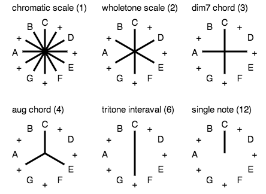

We can immediately make some observations.

- There can only be 1 chromatic scale, 2 wholetone scales, 3 diminished
  7th chords, etc

- A dim7 chords is built of 2 tritones, while a wholetone scale is built
  of 3 tritones.

# Scales

## Major

Notice how the dorian mode is symmetrical.

## Minor

I mean the jazz minor. It has only a flatted 3rd.

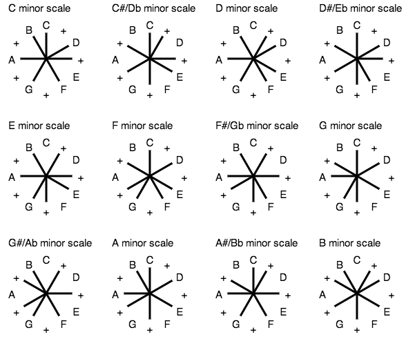

## Bebop

After a moment, it becomes clear that this is just a diminished and 7th
chord added together. Look for the diminished chord's cross.

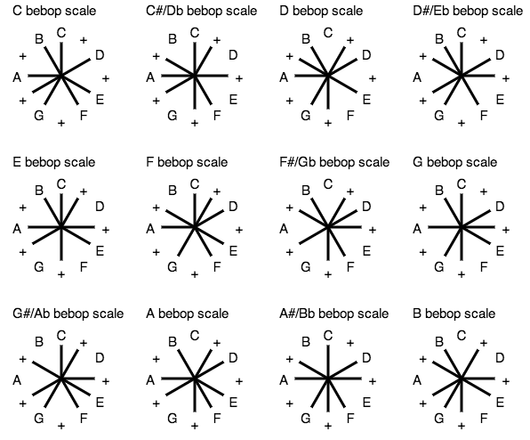

## Diminished

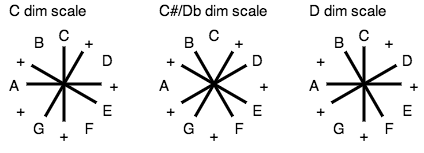

Note how clear it is from the symmetries of the graph that there can be
only 3 distinct diminished scales.

# Triads

## Major

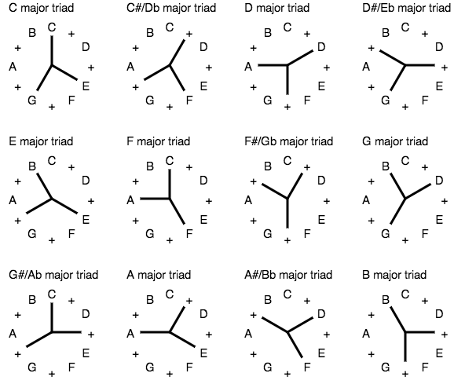

## Minor

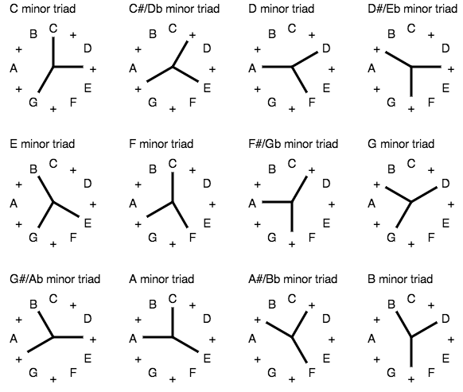

# 7ths

## Major

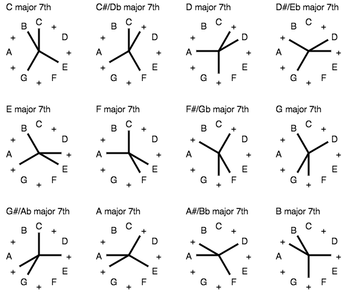

## Minor

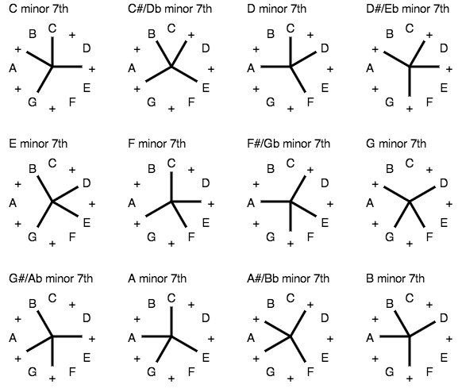

## Dominant

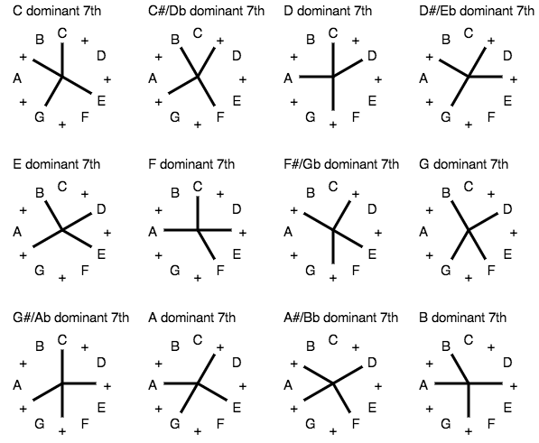

## Alt

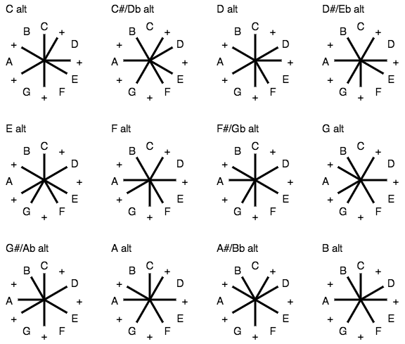

## Diminished

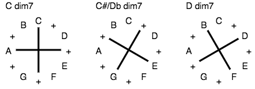

# ii-V-I progression

# Further work

It'd be neat to see this animated or interactive in some way. ... But so
far I haven't figured out an interesting way for that to work. If you
have ideas, let me know.
