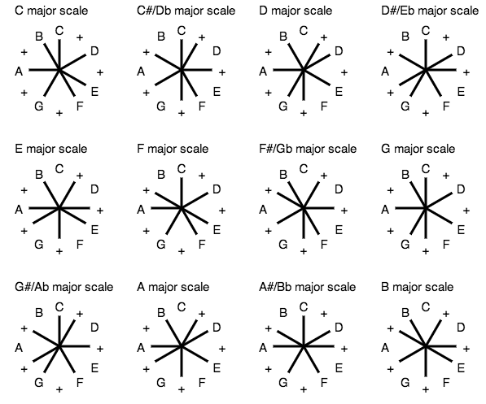
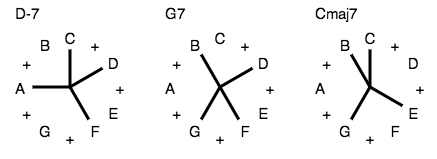

# What are these?

I call them *radial graphs*. They're an alternative way to visualize
harmonic theory. Advantages:

- Uniform spacing. Unlike on a musical staff, equal distances mean equal
  intervals.

- Make intervals obvious. For example, straight line always means a
  tritone.

- Ignore inversions. There's no top and bottom to worry about, and no
  voicings either. Focus on the theory.

So far as I can google, I think I invented them. If you know different,
please drop me a line.

# Introduction

The chromatic scale, being comprised of 12 notes, can be evenly divided
6 ways: by 1, 2, 3, 4, 6, and 12. Doing this, we see

We can immediately make some observations.

- There can only be 1 chromatic scale, 2 wholetone scales, 3 diminished
  7th chords, etc

- A dim7 chords is built of 2 tritones, while a wholetone scale is built
  of 3.

# Scales

Note how clear it is from the symmetries of the graph that there can be
only 3 distinct diminished scales.

# Triads

# 7ths

# ii-V-I progression

